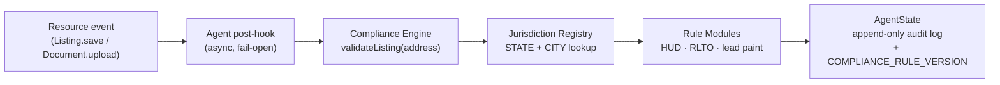

# Tenura — Architecture Showcase

> **RegTech for affordable housing.** A curated subset of the Tenura codebase — compliance engine, agent architecture, decision records, and operator runbooks — published to demonstrate engineering discipline, not to expose the full application.

**Mission lock:** Tenura is structurally committed to direct 100% of net revenue — above operating costs and a fixed, publicly disclosed founder compensation ceiling — toward building new affordable housing units. See [`mission.md`](./mission.md).

---

## At a Glance

| | |
|---|---|
| **Stack** | Node.js · Express · MongoDB · React 19 · Vite · Socket.io · Jest |
| **Domain** | HCV / Section 8 leasing, HUD compliance, Chicago RLTO, lead paint, HQS |
| **Status** | Pre-pilot. Compliance engine and four deterministic agents are production-ready; Phase 9 lease audit engine deliberately gated on practitioner validation. |
| **Author** | Stacey Spears — Salesforce Administrator & Full Stack Developer (RegTech) |

---

## Why This Repo Exists

Tenura is a full-stack MERN platform that connects voucher holders and income-qualified renters with landlords accepting government housing assistance programs (HCV/Section 8, LIHTC, income-restricted units). The full codebase is private — it touches legal compliance, audit trails, and tenant data, and the engineering choices that protect those concerns are the ones worth showing.

This repository is the reading-order version of those choices: the compliance engine that runs jurisdiction-aware rule checks, the deterministic agent that persists every check as an audit record, the decision log that captures *why* alternatives were rejected, and the runbooks that describe what a single operator does when something breaks at 2 a.m. It is intended to demonstrate code quality, architectural discipline, and documentation practices — not to be cloned, forked, or run.

---

## Read These First

A six-minute reading order if you only have six minutes:

1. [`mission.md`](./mission.md) — the revenue pledge and what the platform is actually for.
2. [`architecture/decisions.md`](./architecture/decisions.md) — fourteen Architecture Decision Records and an overrides table. **Start with ADR #2** (two-axis lease state), **ADR #6** (jurisdiction derived from address), and **ADR #8** (Lease Health Score is per-lease, not per-tenant — to avoid source-of-income discrimination under the Fair Housing Act).
3. [`compliance-engine/`](./compliance-engine/) — modular, jurisdiction-aware rule files. Adding a new jurisdiction is one rule file plus one line in the registry.
4. [`agents/ComplianceAgent.js`](./agents/ComplianceAgent.js) — the deterministic agent that runs the engine on resource events and persists a full audit log.
5. [`tests/ComplianceAgent.test.js`](./tests/ComplianceAgent.test.js) — integration tests covering pass, fail, warning, and jurisdiction-isolation scenarios.
6. [`runbooks/INDEX.md`](./runbooks/INDEX.md) — what to do first when something goes wrong, written for a single operator.

---

## Architecture at a Glance

Four agents (Compliance, Placement, Notification, Platform) run as async post-hooks on resource events. They are rule-based, never LLM-backed, because housing compliance requires legal citability and zero hallucination risk. Every run is persisted to `AgentState` with a full `actionLog` for observability. The single planned exception — the Phase 9 Lease Audit Engine — is documented in [ADR #1](./architecture/decisions.md) and gated on a practitioner validation conversation before any code is written ([ADR #12](./architecture/decisions.md)).

---

## Architecture Highlights

**Compliance engine.** Federal housing regulations (HUD Section 8, lead paint) and local ordinances (Chicago RLTO) change independently of the UI. The engine is a standalone service with no UI coupling. Rule files are isolated modules. A jurisdiction registry maps `address → applicable rules` automatically. A semver `COMPLIANCE_RULE_VERSION` is stamped on every audit record so results are reproducible months later.

**Two-axis lease state.** `Lease` carries two independent enums: `leaseStatus` and `hapStatus`. HQS abatement (PHA withholds HAP after a failed inspection) is not a lease termination. Voucher loss terminates the HAP contract but not the tenancy. Collapsing these into one field would force incorrect cascades; separating them reflects how housing law actually works.

**Lease Health Score is per-lease, not per-tenant.** The composite score (payment + HQS + HAP + communication) is attached to the lease relationship, not the tenant. A tenant-level score would be legally precarious under the Fair Housing Act's source-of-income protections and adversarial in posture. A relationship-level score has two owners and is actionable by both.

**Scoring without storage.** Trust scores and landlord merit scores are pure functions computed at request time — no DB column. Scores are always current, ungameable via column tampering, and independently testable without fixtures.

**Append-only history.** `paymentStructureHistory`, `Application.auditTrail`, `Listing.statusHistory`, and `Lease.hqsInspections` are append-only by design. Rent changes carry a reason discriminator (`initial | abatement | termination | recertification | reinstatement`) so any rent record can be reconstructed for PHA, tenant, or IRS audit.

**Immutable counterparty.** When a lease is created, `Listing.legalOwner` is *copied* into `Lease.ownerOfRecord`, not referenced. A property sale or management change must not invisibly rewrite the counterparty of an active HAP contract.

---

## Application Stack (Full Project)

- **Backend:** Node.js, Express.js
- **Database:** MongoDB, Mongoose
- **Frontend:** React 19, Vite
- **Auth:** JWT, bcryptjs
- **Real-time:** Socket.io
- **File storage:** Cloudinary
- **Email:** Nodemailer
- **Testing:** Jest, Supertest, mongodb-memory-server
- **Deployment:** Render (API), Vercel (client)

The full codebase contains 33+ test files. This showcase includes one — `tests/ComplianceAgent.test.js` — chosen because it exercises the compliance integration path end-to-end (Supertest + in-memory Mongo, real HTTP through auth + validation + DB write).

---

## Testing Approach

Unit tests cover pure-function utilities (trust score, compliance rules, state machines) in complete isolation — no fixtures, no DB. Integration tests use Supertest plus an in-memory MongoDB instance to fire real HTTP requests against the full request-response cycle (auth middleware → validation → database write → response format) from a deterministic starting state on every run. The included `ComplianceAgent.test.js` is one example.

---

## Development Philosophy

The Architecture Decision Records capture not just what was built but why alternatives were rejected. Decisions that involve legal surface area — the Phase 9 Lease Audit Engine, rent reasonableness — are explicitly gated on practitioner validation before code is written. The ADR index also records the places where the founder's judgment overrode a proposed direction; those overrides are as important as the decisions themselves.

---

## Tools & Methodology

The architecture, decision records, and product judgment in this repository are the founder's. The legal-domain reasoning — fair housing, source-of-income protections, HAP contract counterparty integrity, audit-trail requirements — is human-authored and human-owned, because incorrect output in this domain is not a bug, it is a discrimination claim or an audit finding.

AI tools (Claude) are used as drafting and review collaborators: rubber-ducking, pattern-checking, and producing first drafts that the founder edits, validates, or rejects. The clearest evidence of where that boundary holds is [ADR #12](./architecture/decisions.md): no Lease Audit Engine code is written before a real conversation with a Chicago landlord-tenant practitioner. Tooling does not relax legal-surface gates.

---

## Usage & Reuse

This repository is published for evaluation and reading only. The compliance logic, agent architecture, and decision records are not licensed for reuse, redistribution, or derivative work. There is no LICENSE file because none is being granted.

If you are interested in licensing, partnering, or discussing the work, please reach out at **[stacey@staceyspears.dev](mailto:stacey@staceyspears.dev)**.

---

## Author

**Stacey Spears**
Salesforce Administrator & Full Stack Developer (RegTech) — Evergreen Park, IL (Chicagoland)

- LinkedIn — https://www.linkedin.com/in/staceyspears2/
- GitHub — https://github.com/staceySpears
- Email — [stacey@staceyspears.dev](mailto:stacey@staceyspears.dev)
- Portfolio — https://staceyspears.github.io *(in progress)*
